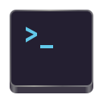

# Console



A minimal terminal for GNOME

Console is supposed to be a simple terminal emulator for the average user to carry out simple cli tasks and aims to be a ‘core’ app for GNOME/Phosh

We are not however trying to replace GNOME Terminal/Tilix, these advanced tools are great for developers and administrators, rather Console aims to serve the casual linux user who rarely needs a terminal

## Roadmap

- [ ] ‘API’ compatible with GNOME Terminal
    - [ ] Command line flags *Partial, supports -e/--command and --working-directory*
- [X] Command done notifications
- [X] ‘root mode’ turns red when sudo/su/pkexec is active in the terminal
- [X] ‘remote mode’ turns (purple?) when ssh is in use
- [ ] Other bash/shell integrations

## Use of Generative AI

Maintainers may use generative AI tools as assistants while working on gnome-console. Non-trivial assisted commits disclose the tool, model, and scope of the work.

AI tools may assist with code comments, documentation, repetitive code, and issue triage. Maintainers make project decisions and review every assisted change before it is merged.

Use these trailers for non-trivial assisted commits:

```plain
Assisted-by: <tool>:<model-version>
AI-Scope: <what the tool generated and the prompt or a short prompt summary>
```

Single-line completions, renames, and formatting changes do not need trailers.

Coding agents must also follow [AGENTS.md](AGENTS.md) before changing files,
creating commits, or opening pull requests.
